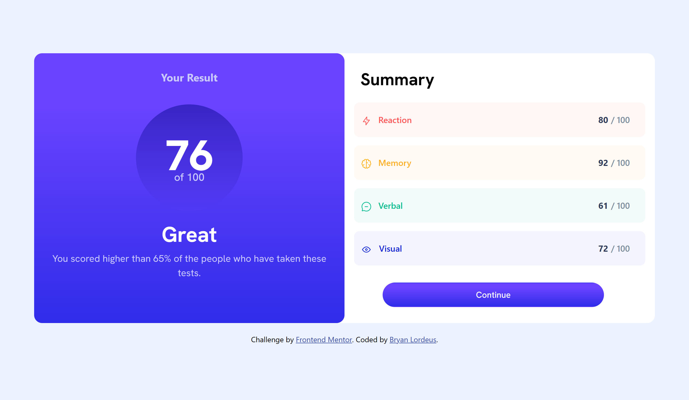

# Frontend Mentor - Results summary component solution

This is a solution to the [Results summary component challenge on Frontend Mentor](https://www.frontendmentor.io/challenges/results-summary-component-CE_K6s0maV). Frontend Mentor challenges help you improve your coding skills by building realistic projects.

## Table of contents

* [Overview](#overview)
    * [The challenge](#the-challenge)
    * [Screenshot](#screenshot)
    * [Links](#links)
* [My process](#my-process)
    * [Built with](#built-with)
    * [What I learned](#what-i-learned)
    * [Continued development](#continued-development)
    * [Useful resources](#useful-resources)
* [Author](#author)

## Overview

### The challenge

Users should be able to:

* View the optimal layout for the interface depending on their device's screen size
* See hover and focus states for all interactive elements on the page

### Screenshot




### Links

* Solution URL: [Solution](https://www.frontendmentor.io/challenges/results-summary-component-CE_K6s0maV/hub)
* Live Site URL: [Live Site](https://blordeus.github.io/results-summary-component-main/)

## My process

### Built with

* Semantic HTML5 markup
* CSS custom properties
* Flexbox
* CSS Grid
* SASS
* Mobile-first workflow
* [Bootstrap](https://getbootstrap.com/docs/5.3/getting-started/introduction/) \- CSS framework

### What I learned

I learned how to use Bootstrap and SASS in order to complete a coding project. Bootstrap provided the grid system and components needed to recreate the structure of the project design while Sass made styling more efficient.

``` html
<div class="col-12 reaction">
        <div class="col-1 justify-content-start">
      
        </div>
        <div class="col-1">
      Reaction
        </div>
         <div class="col-12 justify-content-right summarynumber">
          <span class="result-number-darknavy">80</span> 
          <span class="result-number-gray">/ 100</span>
         </div>
    </div>
```

``` css
.reaction {
  border-radius: 10px;
  font-weight: 500;
  padding: 20px 0px;
  color: hsl(0, 100%, 67%);
  background-color: hsla(0, 100%, 67%, 0.05);
  display: flex;
}
```

``` scss
$font-stack: 'HankenGrotesk', sans-serif;
$gradient: linear-gradient(180deg, rgba(105,67,255,1) 20%, rgba(47,44,233,1) 100%);
$invert-gradient: linear-gradient(360deg, rgba(105, 67, 255, 0.123) 0%, rgba(13, 10, 146, 0.534) 100%);
$left-text-color: rgb(202,201,255);
$right-header: black;
$right-rectangle: 10px;
$rectangle-pad: 20px 0px;
```

### Continued development

I want to continue learning more about Bootstrap and Sass so that I could better implement them in future projects. So far, Bootstrap contains my favorite toolkit for front end development.

### Useful resources

* [Bootstrap](https://getbootstrap.com/docs/5.3/getting-started/introduction/) \- Contained all the relevant docs needed to learn more about the framework and to complete the project\.

## Author

* Frontend Mentor - [@blordeus](https://www.frontendmentor.io/profile/blordeus)
* Twitter - [@bryancreates](https://www.twitter.com/bryancreates)
